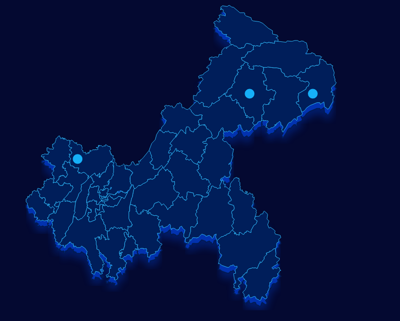

##多边形柱状图说明文档

###1 使用说明
```
var map = require('map')
var config = {
          width: width,
          height: height,
          id: 'map',
          area: 'chongqing',
          itemStyle: {
            fill: '#001e5a',
            stroke: '#2fb9f8',
            strokeWidth: 1,
            emphasis: {
              fill: '#04184b',
              stroke: '#2fb9f8',
              strokeWidth: 1
            },
            filters: {
              opacity: 0.4,
              fill: ['#023ac0', '#0232af'],
              stroke: '#011a53',
              strokeWidth: 2
            }
          },
          markPoint: {   
            symbol: 'circle', //circle, image
            fill: '#16b0f8',
            radius: 10
          },
          tooltip: {
            className: 'tooltip'
          }
        }
        var data = [
          {
            "name": "云阳县",
            "geoCoord": [108.83034075456257, 31.009656231968137]
          },{
            "name": "巫山县",
            "geoCoord": [109.83034075456257, 31.009656231968137]
          },{
            "name": "合川区",
            "geoCoord": [106.10834075456257, 30.119656231968137]
          }
        ]
        var svg = d3.select('#map')
            .append("svg")
            .attr("width", width)
            .attr("height", height)
            .style('padding', '20px')

        map.init(svg, data, config)

```
###2 效果展示



###3 接口说明
####3.1 接口调用
调用方式：`map.init(svg, data, config)`

参数说明：

- svg: svg实例
- data：数据
- config：配置项

### 配置项参数说明

| 字段                             | 含义         | 是否必选 | 默认值                    | 备注               |
| ------------------------------ | ---------- | ---- | ---------------------- | ---------------- |
| width                          | svg宽度      | 是    | 无                      |                  |
| height                         | svg高度      | 是    | 无                      |                  |
| id                             | svg父级id    | 是    | map                    |                  |
| itemStyle                      | 地图样式       | 否    |                        |                  |
| itemStyle.fill                 | 填充色        | 否    | #001e5a                |                  |
| itemStyle.stroke               | 边框颜色       | 否    | #2fb9f8                |                  |
| itemStyle.strokeWidth          | 边框线宽       | 否    | 1                      |                  |
| itemStyle.emphasis             | 鼠标悬浮当前区域样式 | 否    |                        |                  |
| itemStyle.emphasis.fill        | 当前区域填充色    | 否    | #04184b                |                  |
| itemStyle.emphasis.stroke      | 当前区域填充色    | 否    | #2fb9f8                |                  |
| itemStyle.emphasis.strokeWidth | 边框宽        | 否    | 1                      |                  |
| itemStyle.filters              | 地图滤镜样式     | 否    |                        |                  |
| itemStyle.filters.opacity      | 滤镜透明度      | 否    | 0                      |                  |
| itemStyle.filters.opacity      | 滤镜填充色      | 否    | ['#023ac0', '#0232af'] | 滤镜用使用了两层，可配置两种颜色 |
| itemStyle.filters.stroke       | 边框颜色       | 否    | #011a53                |                  |
| itemStyle.filters.strokeWidth  | 边框宽        | 否    | 2                      |                  |
| markPoint                      | 地图标注点样式    | 否    |                        |                  |
| markPoint.symbol               | 样式类型       | 否    | circle                 |                  |
| markPoint.fill                 | 填充色        | 否    | #16b0f8                |                  |
| markPoint.radius               | 半径         | 否    | 10                     |                  |
| tooltip                        | 提示框        | 否    |                        |                  |
| tooltip.className              | 提示框类名      | 否    | tooltip                |                  |


